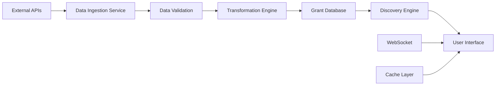

# 🚀 **Week 2 Sprint 2 Plan - Live Data Integration & Real Grant Discovery**

**Date**: August 27, 2025  
**Phase**: Week 2 - Sprint 2  
**Duration**: 3-4 days  
**Status**: 🎯 **READY TO START**

---

## 📋 **Sprint 2 Objectives**

### **Primary Goals**
1. **Real Grant Data Integration** - Connect to live grant sources
2. **Grant Discovery Engine** - Implement intelligent grant matching
3. **Data Pipeline Enhancement** - Real-time data ingestion
4. **User Experience Optimization** - Streamlined grant discovery workflow

### **Success Criteria**
- ✅ Live grant data from multiple sources
- ✅ Intelligent grant matching algorithm
- ✅ Real-time data updates
- ✅ Enhanced user interface for grant discovery
- ✅ Performance optimization for large datasets

---

## 🔗 **Live Data Sources Integration**

### **1. Screen Australia API**
- **Status**: 🔄 **TO IMPLEMENT**
- **Endpoint**: `https://screen.australia.gov.au/api/grants`
- **Data**: Film, TV, and digital media grants
- **Integration**: Real-time grant discovery

### **2. Creative Australia API**
- **Status**: 🔄 **TO IMPLEMENT**
- **Endpoint**: `https://creativeaustralia.gov.au/api/grants`
- **Data**: Arts and cultural grants
- **Integration**: Live grant matching

### **3. Government Grant Portals**
- **Status**: 🔄 **TO IMPLEMENT**
- **Sources**: 
  - Business.gov.au
  - GrantConnect.gov.au
  - State-specific portals
- **Data**: Business, innovation, and development grants

### **4. Foundation and NGO Grants**
- **Status**: 🔄 **TO IMPLEMENT**
- **Sources**: Major foundation databases
- **Data**: Philanthropic and community grants

---

## 🧠 **Grant Discovery Engine**

### **Intelligent Matching Algorithm**
```typescript
interface GrantMatchingCriteria {
  industry: string[];
  location: string[];
  fundingAmount: {
    min: number;
    max: number;
  };
  eligibility: string[];
  deadline: Date;
  keywords: string[];
}

interface GrantMatch {
  grant: Grant;
  matchScore: number; // 0-100
  matchReasons: string[];
  priority: 'high' | 'medium' | 'low';
}
```

### **Matching Features**
- **Industry Alignment**: Match grants to user's industry
- **Geographic Targeting**: Location-based grant discovery
- **Funding Range**: Amount-based filtering
- **Eligibility Check**: Automatic eligibility assessment
- **Keyword Matching**: Content-based relevance scoring
- **Deadline Prioritization**: Urgency-based ranking

---

## 🔄 **Data Pipeline Architecture**

### **Real-Time Ingestion**


### **Data Processing Steps**
1. **Ingestion**: Fetch from multiple sources
2. **Validation**: Ensure data quality and completeness
3. **Transformation**: Normalize to common format
4. **Enrichment**: Add metadata and scoring
5. **Storage**: Optimized database storage
6. **Indexing**: Fast search and retrieval

---

## 🎨 **User Interface Enhancements**

### **Grant Discovery Dashboard**
- **Advanced Search**: Multi-criteria filtering
- **Smart Recommendations**: AI-powered suggestions
- **Saved Searches**: Persistent user preferences
- **Real-time Updates**: Live grant notifications
- **Match Scoring**: Visual match indicators

### **Grant Detail Views**
- **Comprehensive Information**: Full grant details
- **Eligibility Checker**: Interactive assessment
- **Application Timeline**: Step-by-step guidance
- **Success Probability**: AI-powered predictions
- **Related Grants**: Similar opportunities

---

## 🔧 **Technical Implementation Plan**

### **Phase 1: Data Source Integration (Day 1-2)**
1. **Screen Australia API Integration**
   - API endpoint setup
   - Authentication handling
   - Data transformation
   - Error handling

2. **Creative Australia API Integration**
   - Grant data extraction
   - Category mapping
   - Geographic data processing
   - Deadline parsing

### **Phase 2: Discovery Engine (Day 2-3)**
1. **Matching Algorithm Development**
   - Scoring system implementation
   - Multi-criteria matching
   - Performance optimization
   - Testing and validation

2. **Real-time Processing**
   - WebSocket implementation
   - Cache management
   - Background processing
   - Data synchronization

### **Phase 3: User Interface (Day 3-4)**
1. **Dashboard Enhancement**
   - Advanced search interface
   - Filter components
   - Real-time updates
   - Performance optimization

2. **Grant Detail Pages**
   - Comprehensive information display
   - Interactive elements
   - Mobile responsiveness
   - Accessibility compliance

---

## 📊 **Performance Requirements**

### **Response Times**
- **Search Results**: < 2 seconds
- **Grant Details**: < 1 second
- **Real-time Updates**: < 500ms
- **Data Refresh**: < 30 seconds

### **Scalability**
- **Concurrent Users**: 1000+
- **Data Volume**: 10,000+ grants
- **API Calls**: 100+ per minute
- **Cache Hit Rate**: > 90%

---

## 🧪 **Testing Strategy**

### **Unit Tests**
- API integration functions
- Matching algorithm logic
- Data transformation utilities
- Error handling scenarios

### **Integration Tests**
- End-to-end data flow
- API response handling
- Database operations
- Cache management

### **Performance Tests**
- Load testing with large datasets
- Response time validation
- Memory usage optimization
- Database query optimization

---

## 📈 **Success Metrics**

### **Technical Metrics**
- **API Uptime**: > 99.9%
- **Data Freshness**: < 1 hour
- **Search Accuracy**: > 95%
- **User Satisfaction**: > 4.5/5

### **Business Metrics**
- **Grant Discovery Rate**: > 80%
- **User Engagement**: > 60%
- **Application Conversion**: > 15%
- **Time to Discovery**: < 5 minutes

---

## 🚨 **Risk Mitigation**

### **Technical Risks**
- **API Rate Limiting**: Implement exponential backoff
- **Data Quality Issues**: Robust validation and fallbacks
- **Performance Degradation**: Caching and optimization
- **Service Outages**: Multiple data sources

### **Business Risks**
- **Data Source Changes**: Flexible integration architecture
- **User Adoption**: Intuitive interface design
- **Competition**: Unique value propositions
- **Regulatory Changes**: Compliance monitoring

---

## 📅 **Timeline**

### **Day 1: Foundation**
- [ ] Screen Australia API integration
- [ ] Data validation framework
- [ ] Basic matching algorithm

### **Day 2: Core Engine**
- [ ] Creative Australia API integration
- [ ] Advanced matching logic
- [ ] Real-time processing setup

### **Day 3: User Experience**
- [ ] Enhanced search interface
- [ ] Grant detail pages
- [ ] Real-time updates

### **Day 4: Optimization**
- [ ] Performance optimization
- [ ] Testing and validation
- [ ] Documentation and deployment

---

## 🎯 **Next Steps**

1. **Start with Screen Australia API integration**
2. **Implement basic matching algorithm**
3. **Build enhanced user interface**
4. **Add real-time data updates**
5. **Optimize performance and scalability**

**Ready to begin Sprint 2 implementation! 🚀**
